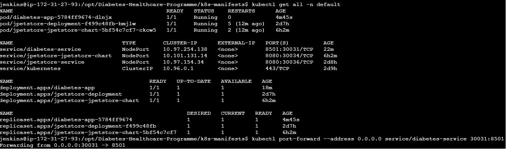
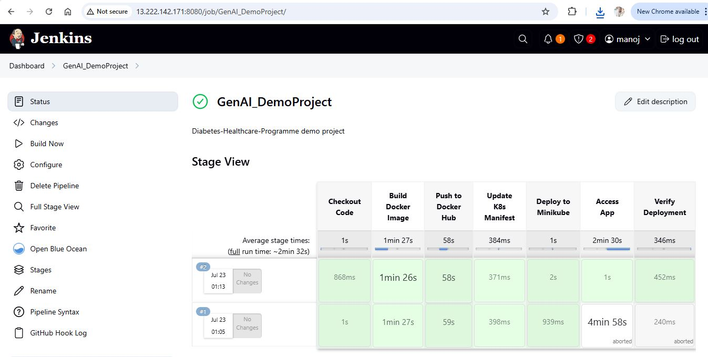
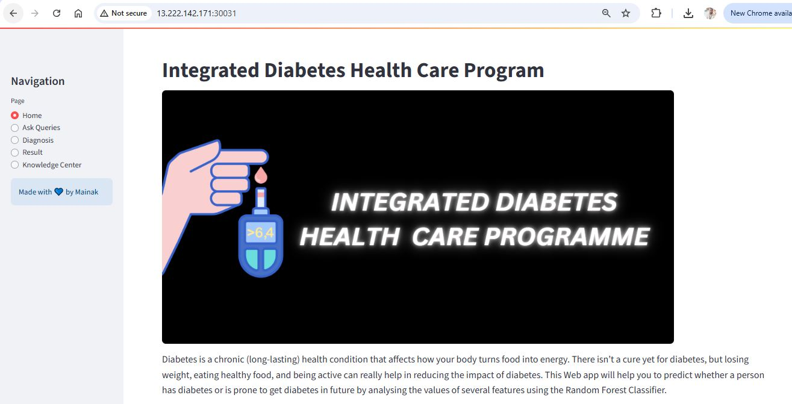
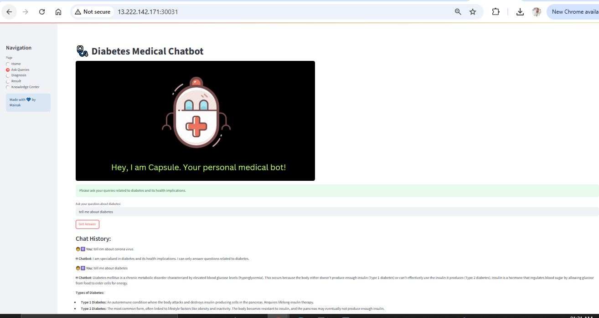
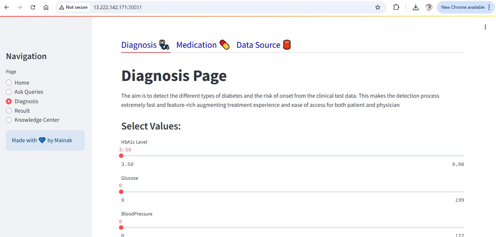

# 🩺 Diabetes Prediction App Deployment

This documentation covers manual and automated deployment of a Diabetes Prediction App using Docker, Minikube, and Jenkins Pipeline. It also includes troubleshooting steps and port-forwarding configuration.

---

## 📦 Application Overview

This app is a **Machine Learning model** that predicts whether a patient is likely to have diabetes based on inputs. It exposes an API using **Streamlit** for implementation.

This is a Streamlit-based web application with the following core features:

🔹 Tabs / Sections:
  - Home — Welcome page with project context
  - Talk2Doc — AI chatbot ("Capsule") for user queries
  - Diagnosis — Predicts diabetes risk based on input data
  - Results — Displays diagnosis results
  - Knowledge Center (future)
  - Ask Queries (search Info about Dianetes)

Each of these is implemented in a separate file in the Tabs/ folder and rendered as tabs via Streamlit’s UI.
---

## 🧩 Application Structure

```bash
.
├── main.py                # Streamlit entry point, loads tabs
├── Tabs/
│   ├── home.py            # Home page
│   ├── talk2doc.py        # Gemini-powered chatbot
│   ├── diagnosis.py       # Input form + ML prediction
│   ├── result.py          # Show results
│   └── kc.py              # (Knowledge Center, WIP)
├── web_functions.py       # Helper functions for prediction
├── requirements.txt
└── .streamlit/
|    └── secrets.toml       # Contains GEMINI_API_KEY
├── k8s-manifests/
│   ├── deployment.yaml
│   └── service.yaml
├── __pycache__
└── Dockerfile
```

## ✅ Prerequisites (on EC2)

- Minikube installed and running (`minikube start`)
- Docker installed
- Jenkins installed and running
- Docker Hub account
- Kubernetes CLI (`kubectl`) installed
- Git repository with:
  - GenAI python project code
  - `Dockerfile`
  - `deployment.yaml` and `service.yaml` Kubernetes manifests

## 📦 Installation Steps

### 🔧 Install Jenkins

**Install Java:**
```bash
sudo apt update
sudo apt install openjdk-21-jdk maven docker.io git unzip curl -y
```
**Install Jenkins:**
```bash
wget -q -O - https://pkg.jenkins.io/debian-stable/jenkins.io.key | sudo tee /usr/share/keyrings/jenkins-keyring.asc > /dev/null
echo deb [signed-by=/usr/share/keyrings/jenkins-keyring.asc] https://pkg.jenkins.io/debian-stable binary/ | sudo tee /etc/apt/sources.list.d/jenkins.list > /dev/null
sudo apt update
sudo apt install jenkins -y

# start Jenkins service
sudo systemctl start jenkins
sudo systemctl enable jenkins
```

### 🔧 Install Docker

```bash
sudo apt-get update
sudo apt-get install -y ca-certificates curl gnupg
sudo install -m 0755 -d /etc/apt/keyrings
curl -fsSL https://download.docker.com/linux/ubuntu/gpg | \
sudo gpg --dearmor -o /etc/apt/keyrings/docker.gpg
echo \
  "deb [arch=$(dpkg --print-architecture) \
  signed-by=/etc/apt/keyrings/docker.gpg] \
  https://download.docker.com/linux/ubuntu \
  $(lsb_release -cs) stable" | \
sudo tee /etc/apt/sources.list.d/docker.list > /dev/null

sudo apt-get update
sudo apt-get install -y docker-ce docker-ce-cli containerd.io
sudo usermod -aG docker $USER
newgrp docker
```
### 🔧 Install kubectl

```bash
curl -LO "https://dl.k8s.io/release/$(curl -s \
https://dl.k8s.io/release/stable.txt)/bin/linux/amd64/kubectl"
chmod +x kubectl
sudo mv kubectl /usr/local/bin/
kubectl version --client
```
### 🔧 Install Minikube

```bash
sudo apt update && sudo apt upgrade -y
sudo apt install -y curl apt-transport-https ca-certificates conntrack
curl -LO https://storage.googleapis.com/minikube/releases/latest/minikube-linux-amd64
sudo install minikube-linux-amd64 /usr/local/bin/minikube
minikube start --driver=docker
```

### 🤖 Where Gemini API Is Used

1. Inside Tabs/talk2doc.py
  - This is the AI Chatbot (Capsule) tab, acting like a virtual doctor.

So every user query gets **sent to Gemini-Pro**, and the **AI-generated response** is displayed as doctor advice

### 📌 What is gemini-pro?
  - gemini-pro is Google's **large language model** that powers conversation, text generation, question-answering, etc., similar to ChatGPT.
  - In this app, it acts as a **medical assistant** — though keep in mind it’s only as reliable as the model + your input prompt (no guarantees of clinical accuracy).

## Generate Gemini API Key

```bash
1. Visit the Gemini API Console
    Open this link:  https://makersuite.google.com/app/apikey

2. Sign In with Your Google Account

3. Generate a New API Key
  - Click "Create API Key"
  - Choose the project or create a new one
  - Copy the API Key shown

4. Store the API Key Securely
  export GEMINI_API_KEY="your_copied_api_key"
  Or store in .env:
  GEMINI_API_KEY=your_copied_api_key

📌 Notes:

  - This key is free for limited usage (read the usage limits in Gemini API pricing).
  - The key allows you to access models like gemini-pro and gemini-pro-vision.
```
## ✅ Test the Key (Optional)
```bash
  curl -H "Content-Type: application/json" \
     -H "Authorization: Bearer $GEMINI_API_KEY" \
     -d '{"contents":[{"parts":[{"text":"Hello, Gemini!"}]}]}' \
     https://generativelanguage.googleapis.com/v1beta/models/gemini-pro:generateContent
```

## Dockerfile

```bash
    # Use official Python 3.12 base image
FROM python:3.12-slim

# Set working directory in container
WORKDIR /app

# Copy all project files into the container
COPY . .

# Install dependencies from requirements.txt
RUN pip install --upgrade pip && pip install -r requirements.txt

# Expose the default Streamlit port
EXPOSE 8501

# Run the Streamlit app
CMD ["streamlit", "run", "main.py", "--server.port=8501", "--server.enableCORS=false"]
```
## 🧪 3. Jenkins Pipeline Deployment on Minikube
```bash
pipeline {
    agent any

    environment {
        IMAGE_TAG = "diabetes-app"
        IMAGE_NAME = "amanoj3452/genai-projects"
        K8S_DIR = "k8s-manifests"
        APP_NAME = "diabetes-app"
    }

    stages {

        stage('Checkout Code') {
            steps {
                git branch: 'Diabetes-Healthcare-Programme', 
                    url: 'https://github.com/amanoj553/GenAI_Python_Projects.git'
            }
        }

        stage('Build Docker Image') {
            steps {
                sh '''
                docker build -t $IMAGE_NAME:$IMAGE_TAG .
                '''
            }
        }

        stage('Push to Docker Hub') {
            steps {
                withCredentials([usernamePassword(credentialsId: 'dockerhub-creds', usernameVariable: 'DOCKER_USER', passwordVariable: 'DOCKER_PASS')]) {
                    sh '''
                    echo "$DOCKER_PASS" | docker login -u "$DOCKER_USER" --password-stdin
                    docker push $IMAGE_NAME:$IMAGE_TAG
                    docker logout
                    '''
                }
            }
        }

        stage('Update K8s Manifest') {
            steps {
                sh '''
                sed -i "s|image:.*|image: $IMAGE_NAME:$IMAGE_TAG|" $K8S_DIR/deployment.yaml
                '''
            }
        }

        stage('Deploy to Minikube') {
            steps {
                sh '''
                kubectl apply -f $K8S_DIR/deployment.yaml
                // kubectl apply -f $K8S_DIR/service.yaml
                '''
            }
        }

        stage('Access App') {
            steps {
                sh '''
                echo "Waiting for deployment to be available..."
                kubectl rollout status deployment/$APP_NAME --timeout=60s
                
                echo "Fetching service URL..."
                minikube service diabetes-service --url

                echo "Forwarding port..."
                nohup kubectl port-forward --address 0.0.0.0 service/diabetes-service 30031:8501 &
                '''
            }
        }

        stage('Verify Deployment') {
            steps {
                sh 'kubectl get all -o wide'
            }
        }
    }
}

```

## 🔧 1. Manual Deployment using Docker

### ✅ Steps:

1. Clone the repository:
   ```bash
   git clone https://github.com/your-repo/diabetes-app.git
   cd diabetes-app
   ```
2. Create the Docker image:
    ```bash
    docker build -t diabetes-app:latest .
    ```
3. Run the container:
   ```bash
   docker run -d -p 8501:8501 -e GEMINI_API_KEY=$GEMINI_API_KEY diabetes-app:latest
   ```
4. Access the application:
   ```bash
   Browser: http://<EC2_PUBLIC_IP>:8501
   ```


 ## Jenkins Build Logs:

### Jenkins Build and Deployment Log – Successful WAR Deployment to minikube cluster:

[View Log File for Docker Container Deployment](Build_log_GenAI_DemoProject.txt)
  
### Build Success Screenshots – WAR Deployment to Tomcat












## Accessing the Application

- **Automatically (inside pipeline)**:
  - Port-forwarding via:
    ```bash
    kubectl port-forward --address 0.0.0.0 service/jpetstore-service 30031:8501

    ```
Now visit: http://<Public-IP>:30031 in your browser

- **Manually** (if auto fails):
    ```bash
    kubectl port-forward --address 0.0.0.0 service/jpetstore-service 30031:8501
    ```
- **Open in Browser**:
  ```
  http://<host-ip>:30031
  or
  http://localhost:30031
  ```


## Common Troubleshooting

### 1. ❌ `minikube service <svc-name> --url` shows service but inaccessible

**Root Cause**: Pod for the service is not ready.

**Fix**:
- Check pod status:
  ```bash
  kubectl get pods
  ```
- Wait until the pod is in `Running` and `READY 1/1` state.

---

### 2. ❌ `port-forward` works only when run manually

**Root Cause**: Background `nohup` command inside Jenkins may not persist or bind properly due to Jenkins user's environment.

**Fixes**:
- Make sure `--address 0.0.0.0` is used.
- Use port-forward as a `manual post-step` after build in Jenkins.
- Ensure Jenkins user has Kubernetes access (`kubectl config` is set up properly).

---

### 3. ❌ Port not accessible externally:

  - Ensure:
    - You use --address 0.0.0.0
    - Security group of EC2 allows port 30031 (for minikube), 8501 (for normal deocker deployment)

---

## Notes

- `NodePort` must be exposed and firewall should allow the port.
- Jenkins container (if running inside Docker) must have access to host network or `kubectl` must work inside.
- Ensure Jenkins has access to kubectl and Minikube.
- Jenkins agent/node must have Minikube configured.
- Port-forward is only valid as long as the process is running.
- For production, avoid port-forward and use Ingress or LoadBalancer service type.

## Optional Enhancements

- Replace NodePort with Ingress for real-world deployments.
- Replace Gemini API with ChatGPT (OpenAI) (Alternate option for Gemini AI)

  
## ✅ Replace Gemini API with ChatGPT (OpenAI) (Alternate option for Gemini AI)

🔁 This is the best alternative because:

  - It provides an API for text-based models like gpt-3.5-turbo and gpt-4.
  - we can directly plug it into the talk2doc.py file with minimal code changes.

### 🔧 How to Replace with ChatGPT
🧪 **Step-by-Step:**

**Install OpenAI SDK:**
```bash
    pip install openai
```

**Update** .streamlit/secrets.toml:
```bash
    OPENAI_API_KEY = "your_openai_api_key"
```
**Update** `talk2doc.py` (replace Gemini logic):
```bash
    import openai
import streamlit as st

openai.api_key = st.secrets["OPENAI_API_KEY"]

st.title("Talk to AI Doctor (powered by ChatGPT)")

prompt = st.text_input("Enter your symptoms or query")

if prompt:
    response = openai.ChatCompletion.create(
        model="gpt-3.5-turbo",  # or gpt-4 if you have access
        messages=[
            {"role": "system", "content": "You are a medical assistant helping users with diabetes-related queries."},
            {"role": "user", "content": prompt}
        ]
    )
    st.write(response["choices"][0]["message"]["content"])
```

✅ Done — you’re now using ChatGPT via OpenAI instead of Gemini.
